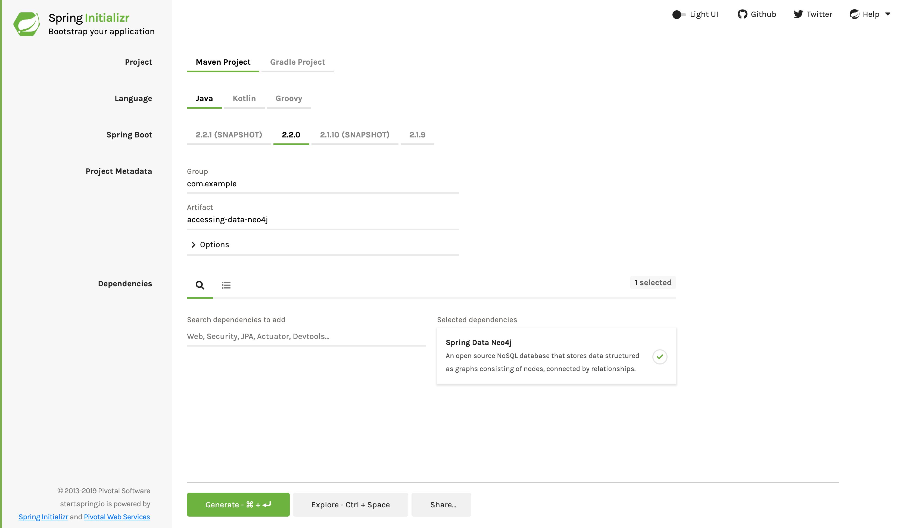

:toc:
:icons: font
:source-highlighter: prettify
:project_id: gs-accessing-data-neo4j

This guide walks you through the process of using
https://projects.spring.io/spring-data-neo4j/[Spring Data Neo4j] to build an application
that stores data in and retrieves it from https://www.neo4j.com/[Neo4j], a graph-based
database.

== What You Will Build

You will use Neo4j's https://wikipedia.org/wiki/NoSQL[NoSQL] graph-based data store to
build an embedded Neo4j server, store entities and relationships, and develop queries.

== What You Need

:java_version: 1.8
include::https://raw.githubusercontent.com/spring-guides/getting-started-macros/master/prereq_editor_jdk_buildtools.adoc[]

include::https://raw.githubusercontent.com/spring-guides/getting-started-macros/master/how_to_complete_this_guide.adoc[]

[[scratch]]
== Starting with Spring Initializr

For all Spring applications, you should start with the https://start.spring.io[Spring
Initializr]. The Initializr offers a fast way to pull in all the dependencies you need for
an application and does a lot of the set up for you. This example only needs the Spring Data Neo4j starter. 
The following image shows the
Initializr set up for this sample project:

You can follow this https://start.spring.io/#!type=maven-project&language=java&platformVersion=2.1.9.RELEASE&packaging=jar&jvmVersion=1.8&groupId=com.example&artifactId=accessing-data-neo4j&name=accessing-data-neo4j&description=Demo%20project%20for%20Spring%20Boot&packageName=com.example.accessing-data-neo4j&dependencies=data-neo4j[link] to create the project skeleton.

NOTE: The preceding image shows the Initializr with Maven chosen as the build tool. You
can also use Gradle. It also shows values of `com.example` and `accessing-data-neo4j` as
the Group and Artifact, respectively. You will use those values throughout the rest of
this sample.

The following listing shows the `pom.xml` file created when you choose Maven:

====
[src,xml]
----
include::complete/pom.xml[]
----
====

The following listing shows the `build.gradle` file created when you choose Gradle:

====
[src,groovy]
----
include::complete/build.gradle[]
----
====

== Standing up a Neo4j Server

Before you can build this application, you need to set up a Neo4j server.

Neo4j has an open source server you can install for free.

On a Mac that has Homebrew installed, run the following command:

====
[src,bash]
----
$ brew install neo4j
----
====
For other options, visit https://neo4j.com/download/community-edition/.

Once installed, launch it with its default settings by running the following command:

====
[src,bash]
----
$ neo4j start
----
====

You should see output similar to the following:

====
[src,bash]
----
Starting Neo4j.
Started neo4j (pid 96416). By default, it is available at http://localhost:7474/
There may be a short delay until the server is ready.
See /usr/local/Cellar/neo4j/3.0.6/libexec/logs/neo4j.log for current status.
----
====

By default, Neo4j has a username and password of `neo4j` and `neo4j`. However, it requires
that the new account password be changed. To do so, run the following command:

====
[src,bash]
----
curl -v -u neo4j:neo4j POST localhost:7474/user/neo4j/password -H "Content-type:application/json" -d "{\"password\":\"secret\"}"
----
====

This changes the password from `neo4j` to `secret` -- something to NOT do in production!
With that step completed, you should be ready to run the rest of this guide.

[[initial]]
== Define a Simple Entity

Neo4j captures entities and their relationships, with both aspects being of equal
importance. Imagine you are modeling a system where you store a record for each person.
However, you also want to track a person's co-workers (`teammates` in this example). With
Spring Data Neo4j, you can capture all that with some simple annotations, as the following
listing (in `src/main/java/com/example/accessingdataneo4j/Person.java`) shows:

====
[source,java,tabsize=2]
----
include::complete/src/main/java/com/example/accessingdataneo4j/Person.java[]
----
====

Here you have a `Person` class that has only one attribute: `name`.

The `Person` class is annotated with `@NodeEntity`. When Neo4j stores it, a new node is
created. This class also has an `id` marked `@GraphId`. Neo4j uses `@GraphId` internally
to track the data.

The next important piece is the set of `teammates`. It is a simple `Set<Person>` but is
marked as `@Relationship`. This means that every member of this set is expected to also
exist as a separate `Person` node. Note how the direction is set to `UNDIRECTED`. This
means that when you query the `TEAMMATE` relationship, Spring Data Neo4j ignores the
direction of the relationship.

With the `worksWith()` method, you can easily link people together.

Finally, you have a convenient `toString()` method to print out the person's name and that
person's co-workers.

== Create Simple Queries

Spring Data Neo4j is focused on storing data in Neo4j. But it inherits functionality from
the Spring Data Commons project, including the ability to derive queries. Essentially, you
need not learn the query language of Neo4j. Instead, you can write a handful of methods
and let the queries be written for you.

To see how this works, create an interface that queries `Person` nodes. The following
listing (in `src/main/java/com/example/accessingdataneo4j/PersonRepository.java`) shows
such a query:

====
[source,java,tabsize=2]
----
include::complete/src/main/java/com/example/accessingdataneo4j/PersonRepository.java[]
----
====

`PersonRepository` extends the `CrudRepository` interface and plugs in the type on which
it operates: `Person`. This interface comes with many operations, including standard CRUD
(create, read, update, and delete) operations.

But you can define other queries by declaring their method signatures. In this case, you
added `findByName`, which seeks nodes of type `Person` and finds the one that matches on
`name`. You also have `findByTeammatesName`, which looks for a `Person` node, drills into
each entry of the `teammates` field, and matches based on the teammate's `name`.

== Permissions to Access Neo4j

Neo4j Community Edition requires credentials to access it. You can configure these
credential by setting a couple of properties (in
`src/main/resources/application.properties`), as the following listing shows:

====
[src,text]
----
include::complete/src/main/resources/application.properties[]
----
====

This includes the default username (`neo4j`) and the newly set password we picked earlier
(`secret`).

WARNING: Do NOT store real credentials in your source repository. Instead, configure them
in your runtime using
https://docs.spring.io/spring-boot/docs/current/reference/htmlsingle/#boot-features-external-config[Spring Boot's property overrides].

With this in place, you can wire this up and see what it looks like!

== Create an Application Class

Spring Initializr creates a simple class for the application. The following listing shows
the class that Initializr created for this example (in
`src/main/java/com/example/accessingdataneo4j/AccessingDataNeo4jApplication.java`):

====
[source,java,tabsize=2]
----
include::initial/src/main/java/com/example/accessingdataneo4j/AccessingDataNeo4jApplication.java[]
----
====

include::https://raw.githubusercontent.com/spring-guides/getting-started-macros/master/spring-boot-application-new-path.adoc[]

Spring Boot automatically handles those repositories as long as they are included in the
same package (or a sub-package) of your `@SpringBootApplication` class. For more control
over the registration process, you can use the `@EnableNeo4jRepositories` annotation.

NOTE: By default, `@EnableNeo4jRepositories` scans the current package for any interfaces
that extend one of Spring Data's repository interfaces. You can use its
`basePackageClasses=MyRepository.class` to safely tell Spring Data Neo4j to scan a
different root package by type if your project layout has multiple projects and it does
not find your repositories.

Logging output is displayed. The service should be up and running within a few seconds.

Now autowire the instance of `PersonRepository` that you defined earlier. Spring Data
Neo4j dynamically implements that interface and plugs in the needed query code to meet the
interface's obligations.

The `main` method uses Spring Boot's `SpringApplication.run()` to launch the
application and invoke the `CommandLineRunner` that builds the relationships.

In this case, you create three local `Person` instances: Greg, Roy, and Craig.
Initially, they only exist in memory. Note that no one is a teammate of anyone (yet).

At first, you find Greg, indicate that he works with Roy and Craig, and then persist him
again. Remember, the teammate relationship was marked as `UNDIRECTED` (that is,
bidirectional). That means that Roy and Craig have been updated as well.

That is why when you need to update Roy. It is critical that you fetch that record from
Neo4j first. You need the latest status on Roy's teammates before adding Craig to the
list.

Why is there no code that fetches Craig and adds any relationships? Because you already
have it! Greg earlier tagged Craig as a teammate, and so did Roy. That means there is no
need to update Craig's relationships again. You can see it as you iterate over each team
member and print their information to the console.

Finally, check out that other query where you look backwards, answering the question of
"Who works with whom?"

The following listing shows the finished `AccessingDataNeo4jApplication` class (at
`src/main/java/com/example/accessingdataneo4j/AccessingDataNeo4jApplication.java`):

====
[source,java]
----
include::complete/src/main/java/com/example/accessingdataneo4j/AccessingDataNeo4jApplication.java[]
----
====

include::https://raw.githubusercontent.com/spring-guides/getting-started-macros/master/build_an_executable_jar_mainhead.adoc[]
include::https://raw.githubusercontent.com/spring-guides/getting-started-macros/master/build_an_executable_jar_with_both.adoc[]

You should see something similar to the following listing (with other stuff, such as
queries, as well):

====
----
Before linking up with Neo4j...
	Greg's teammates => []
	Roy's teammates => []
	Craig's teammates => []

Lookup each person by name...
	Greg's teammates => [Roy, Craig]
	Roy's teammates => [Greg, Craig]
	Craig's teammates => [Roy, Greg]
----
====

You can see from the output that (initially) no one is connected by any relationship.
Then, after you add people, they are tied together. Finally, you can see the handy query
that looks up people based on teammate.

== Summary

Congratulations! You just set up an embedded Neo4j server, stored some simple related
entities, and developed some quick queries.

NOTE: If you want to expose Neo4j repositories with a hypermedia-based RESTful front end
with little effort, read
link:/guides/gs/accessing-neo4j-data-rest[Accessing Neo4j Data with REST].

== See Also

The following guides may also be helpful:

* https://spring.io/guides/gs/accessing-neo4j-data-rest[Accessing Neo4j Data with REST]
* https://spring.io/guides/gs/accessing-data-mysql/[Accessing Data with MySQL]
* https://spring.io/guides/gs/accessing-data-jpa/[Accessing Data with JPA]
* https://spring.io/guides/gs/accessing-data-mongodb/[Accessing Data with MongoDB]
* https://spring.io/guides/gs/accessing-data-gemfire/[Accessing data with Gemfire]

include::https://raw.githubusercontent.com/spring-guides/getting-started-macros/master/footer.adoc[]
